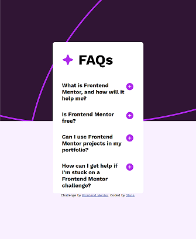

# Frontend Mentor - FAQ accordion solution

This is a solution to the [FAQ accordion challenge on Frontend Mentor](https://www.frontendmentor.io/challenges/faq-accordion-wyfFdeBwBz). Frontend Mentor challenges help me improve my coding skills by building realistic projects.

## Table of contents

- [Overview](#overview)
  - [The challenge](#the-challenge)
  - [Screenshot](#screenshot)
  - [Links](#links)
- [My process](#my-process)
  - [Built with](#built-with)
  - [What I learned](#what-i-learned)
  - [Continued development](#continued-development)
  - [Useful resources](#useful-resources)
- [Author](#author)
- [Acknowledgments](#acknowledgments)

## Overview

### The challenge

Users should be able to:

- Hide/Show the answer to a question when the question is clicked
- Navigate the questions and hide/show answers using keyboard navigation alone
- View the optimal layout for the interface depending on their device's screen size
- See hover and focus states for all interactive elements on the page

### Screenshot




### Links

- Solution URL: [Add solution URL here](https://your-solution-url.com)
- Live Site URL: [Add live site URL here](https://your-live-site-url.com)

## My process

### Built with

- Semantic HTML5 markup
- CSS custom properties
- Flexbox
- Mobile-first workflow
- Vanilla Javascript
- [Styled Components](https://styled-components.com/) - For styles

### What I learned

My major learnings while working through this project.

See below:

```js
document.querySelectorAll(".question-box").forEach((box) => {
  const answer = box.querySelector(".answer");
  const plusIcon = box.querySelector(".icon-plus");
  const minusIcon = box.querySelector(".icon-minus");

  // Set initial state
  answer.style.display = "none";
  minusIcon.style.display = "none";

  box.addEventListener("click", () => {
    if (answer.style.display === "none") {
      answer.style.display = "block";
      plusIcon.style.display = "none";
      minusIcon.style.display = "block";
    } else {
      answer.style.display = "none";
      plusIcon.style.display = "block";
      minusIcon.style.display = "none";
    }
  });
});
```

### Continued development

I want to continue focusing on in future projects. These could be concepts still not completely comfortable with or techniques found useful that want to refine and perfect.

### Useful resources

- [frontendmentor](https://www.frontendmentor.io/) - This resource gives me the opportunities to learn more about the use frontend and real practice code simple challenges for beginners. Respect!
- [freecodecamp](https://www.freecodecamp.org/) - This recource helped me learn to code
- [developer.mozilla](https://developer.mozilla.org) - This helped me as resourses for developers by developers.
- [w3schools](https://www.w3schools.com/) - This is an amazing resource which helped me better understand html, css. I'd recommend it to anyone still learning technical concept.
- [screen resolution simulator](https://searchenginereports.net/screen-resolution-simulator) - This is an amazing resource which helped me.
- [Chrome DevTools](https://developer.chrome.com/docs/devtools/console/) - This recource help me testing html and css.
- [W3C](https://validator.w3.org/) - This recource help me checks the markup validity of Web documents in HTML and CSS.

## Author

- Website - [Add your name here](https://www.your-site.com)
- Frontend Mentor - [@y2lana](https://www.frontendmentor.io/profile/2lana)

## Acknowledgments

Only practice

Grateful for reading and reply to every constructive comment.
